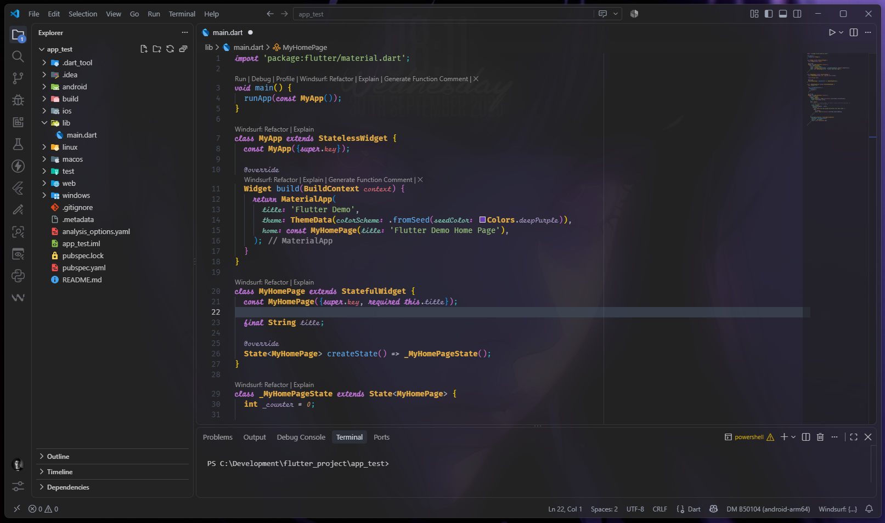

# Amin Dark VS Code Theme

A custom dark theme for [Visual Studio Code](https://code.visualstudio.com/), designed for a clean, modern, and immersive coding experience.

This theme is based on **One Dark Pro**, with several custom changes to the **scope styling**, colors, and overall appearance to create a more personalized look.

## ✨ Features

* 🌑 Dark and minimal interface
* 🎨 Based on **One Dark Pro**
* 🖌️ Custom syntax scope styling
* 🪟 Designed to look great with a transparent / blurred background
* ✍️ Recommended support for both English and Persian fonts
* 💻 Suitable for long coding sessions

## 🪟 Recommended Background Setup

For the best visual experience, I highly recommend using these two VS Code extensions together:

* **Vibrancy Continued** — adds transparency and background blur to VS Code
* **GlassIt** — provides additional transparency and glass-like effects

Using both extensions can significantly improve the appearance of the theme, especially when combined with a suitable desktop wallpaper.

> The theme itself does not provide the blur effect. The blurred/glass background is achieved through these extensions.

## ✍️ Recommended Fonts

For the intended appearance of the theme, I recommend using the following fonts:

### English

**Fira Code iScript** is highly recommended, especially if you like a handwritten / cursive appearance for italic text.

It gives the code editor a more distinctive and elegant look while keeping the regular code readable.

### Persian

For Persian text, **Vazir** is recommended for better readability and a consistent appearance.

## 📦 Installation

You can download or clone this repository and import the theme into VS Code.

```bash
git clone https://github.com/AminSources/amin-dark-vscode-theme.git
```

The main theme file is:

```text
theme.json
```

You can then import or use it as a VS Code color theme.
- Before applying the configuration, be sure to install the fonts (don't forget to install all the fonts).
- You need to apply the configuration in the VS Code `settings.json` file.

## 🎨 Credits

This theme is **based on One Dark Pro**, with custom modifications to its colors and scope styling.

Special thanks to the creators of:

* [One Dark Pro](https://marketplace.visualstudio.com/items?itemName=zhuangtongfa.Material-theme)
* [Vibrancy Continued](https://marketplace.visualstudio.com/items?itemName=illixion.vscode-vibrancy-continued)
* [GlassIt](https://marketplace.visualstudio.com/items?itemName=s-nlf-fh.glassit)
* [Fira Code iScript](https://github.com/tonsky/FiraCode)
* [Vazir](https://github.com/rastikerdar/vazir-font/)

## 📸 Preview

<p align="center">
  
</p>

## 📄 License

See the repository for licensing information.

---

If you like the theme or make your own modifications, feel free to use and customize it.
